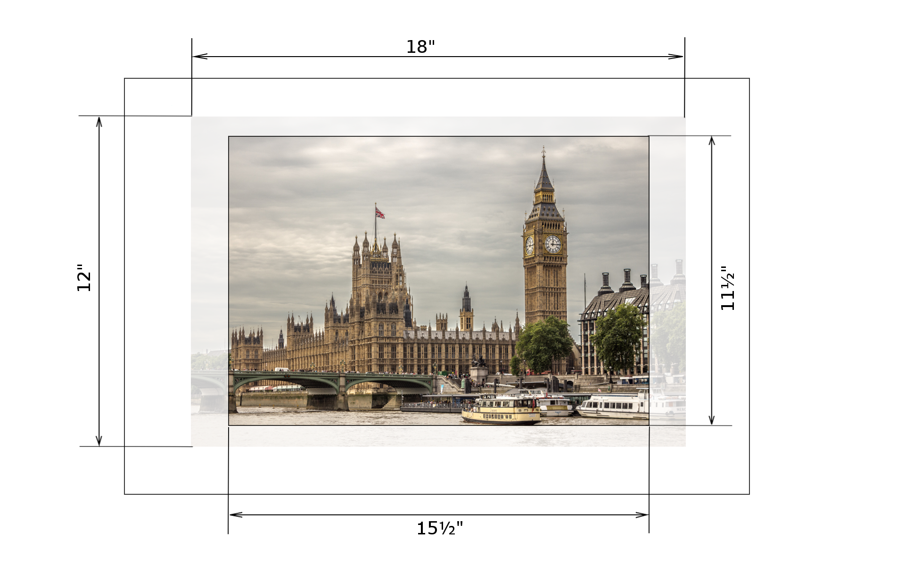
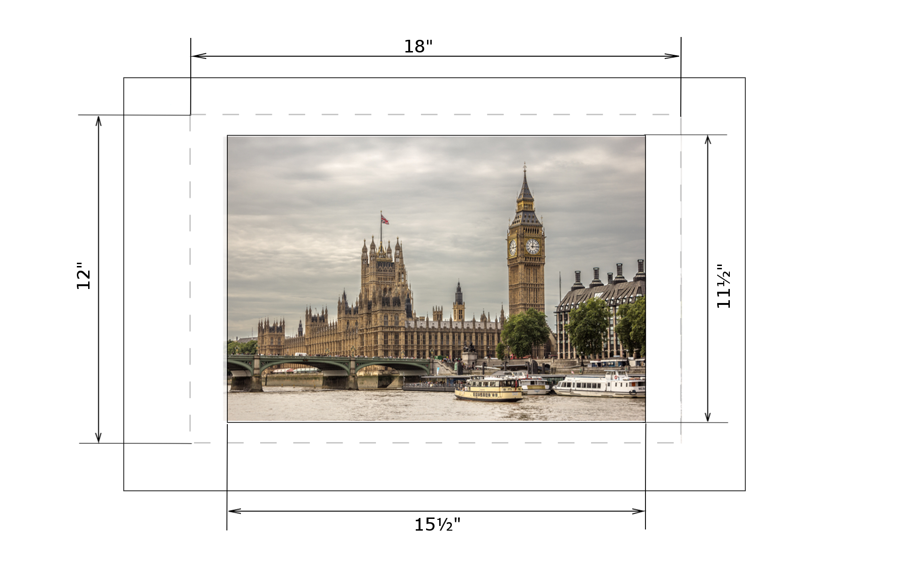
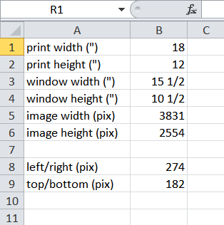
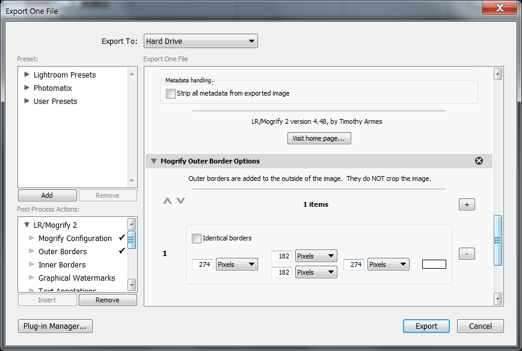
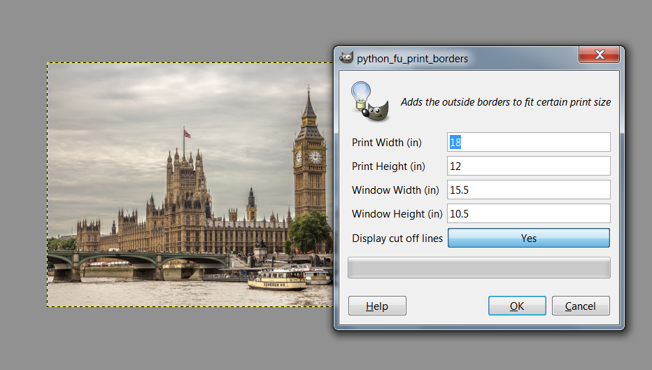

<!DOCTYPE html>
<html>
<head>
<!--<meta charset="UTF-8">-->
<meta name="keywords" content="frame,mat,print,Lightroom,GIMP">
<meta name="author" content="Serge Yuschenko">
</head>

<body>

<h1>Matting and cutting</h1>

There are two ways of matting a picture. The first one when you have a picture and cut a mat to exactly fit the picture. The second one, when you already have a pre-cut mat or a frame, and want to fit a picture into it. In the second case the mat may not have the exactly the same size or aspect ratio as the picture. So you will have to crop it. The question is how much of your precious image you are willing to sacrifice? For instance, if your mat cut off area is 10&#189;&quot;x15&#189;&quot; it is perfect for 11&quot;x16&quot; prints with a &#188;&quot; border. If nobody prints 11&quot;x16&quot; in your neighborhood the only choice is s 12&quot;x18&quot; with a massive cropping in both directions.

<left>

</left>

Obviously the cropping may be minimized by adding a border around the image.

<left>

</left>

It is an easy math to figure out the border width in inches (or millimeters), but the border must be added in a software. Thus you must convert inches to pixels depending on the picture dimensions. This is not a rocket science as well, but takes slightly longer. If you are preparing a number of pictures of different size, the repeating calculations may become annoying. I automated the calculation with an <a href="print_border.xlsx">Excel spreadsheet</a>. The cells in the sheet are self-explanatory, but perhaps it is too much information there. I put there everything in case if I need to do some troubleshooting. You may disregard most of that data. All you need is column B.

<left>

</left>

The workflow is:
<ol>
<li>Enter the print dimensions to B1 and B2</li>
<li>Enter the cut out (window) dimensions to B3 and B4</li>
<li>Enter your image dimensions to B5 and B6</li>
<li>From B8 take the number of pixels to add on left and right</li>
<li>From B9 take the number of pixels to add on top and bottom</li>
</ol>

What you are going to do with these numbers depends on the software you use. There are a number of framing plugins for Lightroom (I use L/R Mogrify 2).

<left>

</left>

I also wrote <a href="print-borders.py">a simple plugin for GIMP</a> that can be accessed via <i>Image->Add Print Borders</i>.

<left>

</left>

<body/>
